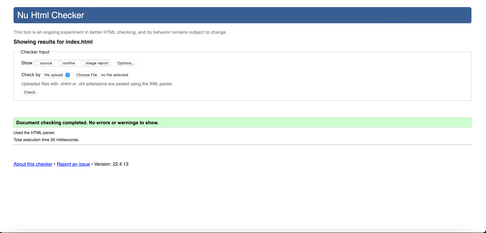

# GatewaySemanticHtml
Revision of Gateway Project

## 1. Here are the screenshot for Validated Index.HTML, Attractions.html, and Contactus.html

---
---
## 2. Here is CSS validation

---
---

## 3. Here are the lighthouse results

